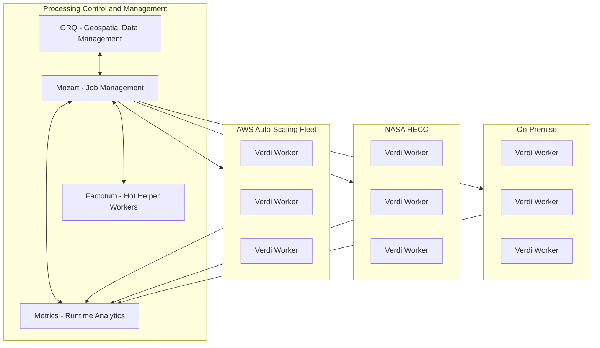
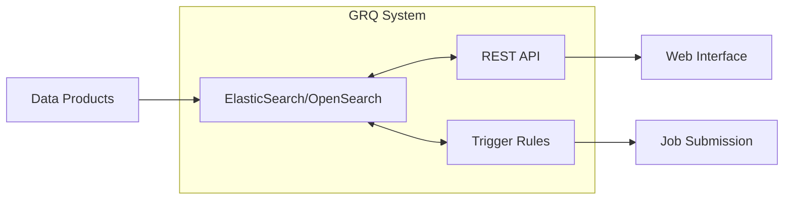
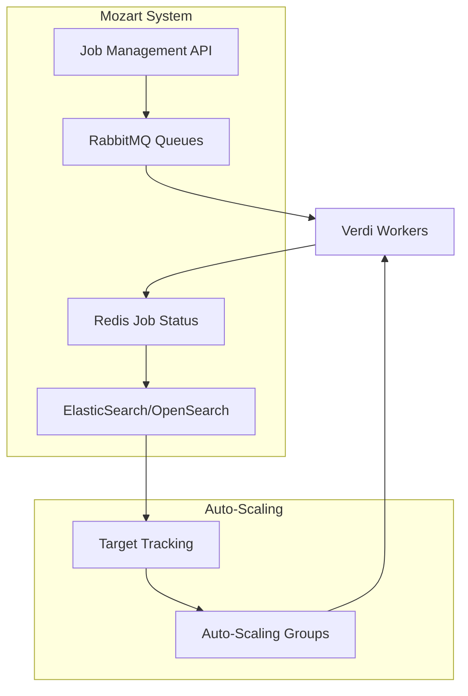
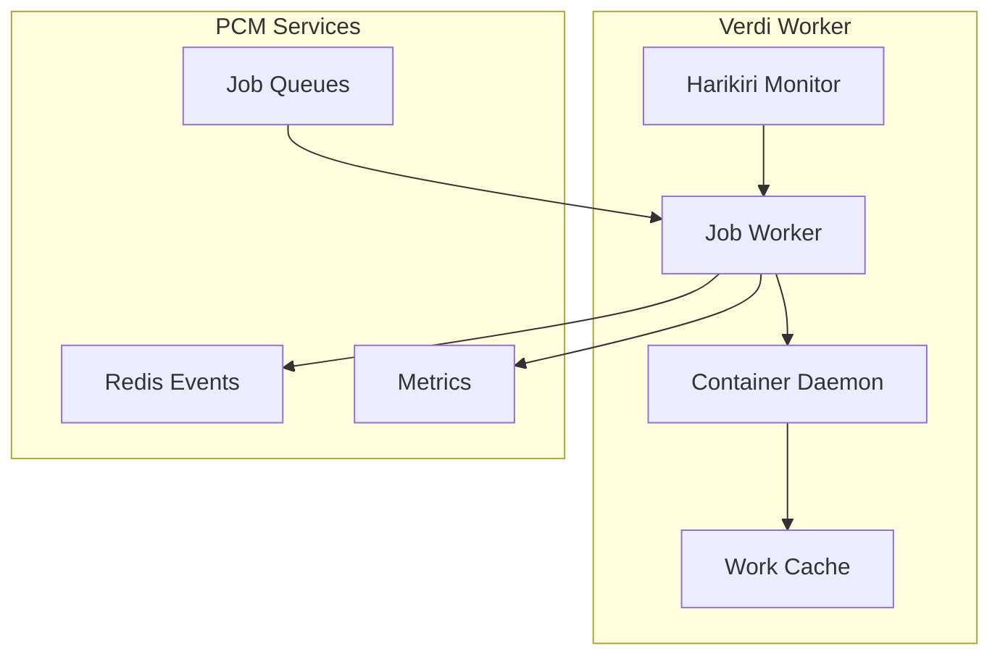
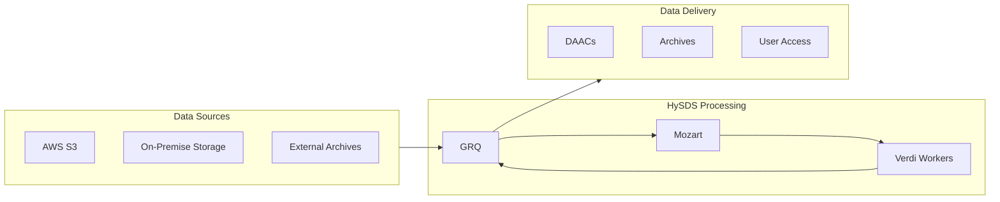
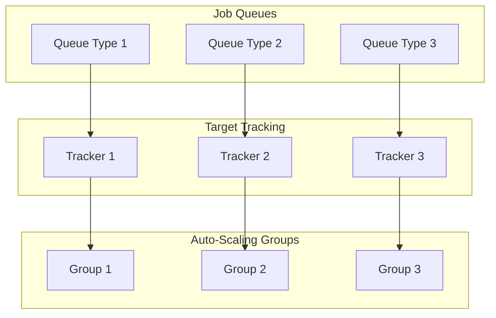
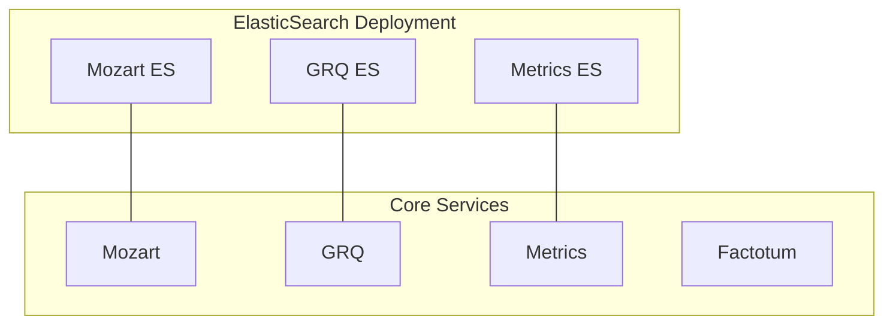
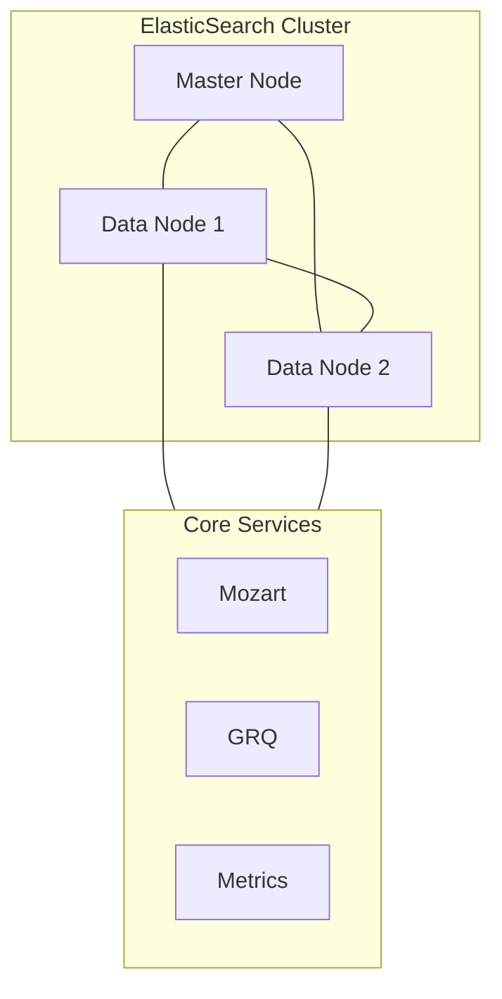
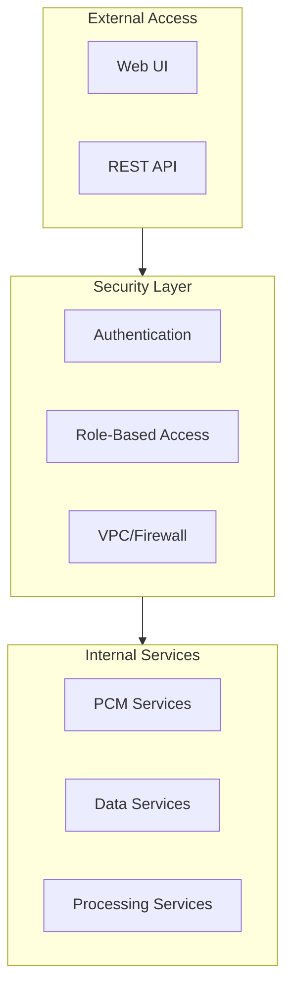

# Design

## System Architecture Overview

HySDS (Hybrid-Cloud Science Data Processing System) uses a distributed architecture designed to support scalable science data processing across hybrid cloud environments. Below is the high-level architecture:

## Core Components

### GRQ (Geo Region Query)
The geospatial data management system that handles data discovery and cataloging.

### Mozart
Job management and orchestration system.

### Verdi Worker Architecture

## Data Flow Architecture

## Auto-Scaling Architecture

## Deployment Options

### Basic Deployment

### High-Availability Deployment

## Security Architecture

## Key Design Considerations

1. **Scalability**
   - Horizontal scaling through auto-scaling groups
   - Distributed processing across multiple environments
   - Queue-based job distribution

2. **Reliability**
   - Fault-tolerant job execution
   - Automatic job recovery
   - Redundant service deployment options

3. **Flexibility**
   - Support for multiple cloud providers
   - Hybrid deployment capabilities
   - Pluggable architecture for different processing needs

4. **Security**
   - Integration with various authentication systems
   - Network isolation through VPCs
   - Role-based access control

5. **Monitoring**
   - Real-time metrics collection
   - Performance monitoring
   - Cost tracking and optimization

## Deployment Best Practices

1. **Resource Sizing**
   - Right-size ElasticSearch clusters based on workload
   - Configure appropriate auto-scaling thresholds
   - Monitor and adjust queue depths

2. **Network Configuration**
   - Ensure proper VPC setup
   - Configure security groups appropriately
   - Set up required VPN connections for hybrid deployments

3. **Storage Management**
   - Implement data lifecycle policies
   - Configure appropriate storage classes
   - Monitor storage usage and costs

4. **Security Configuration**
   - Follow principle of least privilege
   - Regular security updates
   - Audit logging and monitoring

5. **Performance Optimization**
   - Cache frequently accessed data
   - Optimize job scheduling
   - Monitor and tune auto-scaling parameters
