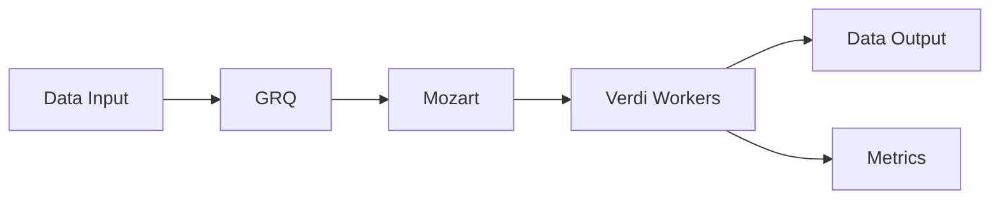

# HySDS Architecture Overview

This guide provides a detailed look at the HySDS (Hybrid-Cloud Science Data Processing System) architecture, its core components, and how they work together to enable scalable science data processing.

## System Components

### Core Components

#### 1. Processing Control and Management (PCM)
- **GRQ (Geo Region Query)**
  - Geospatial data catalog and management
  - Faceted search capabilities
  - Production rules evaluation and actions
  - Data flowing through processing

- **Mozart**
  - Job management and orchestration
  - Faceted search of jobs
  - Production rules evaluation
  - Queue management

- **Metrics**
  - Real-time job metrics
  - Worker metrics analytics
  - Runtime performance monitoring

- **Factotum**
  - "Hot" helper workers
  - Maintains workers for low-latency processes
  - Task orchestration

#### 2. Distributed Processing
- **Verdi Workers**
  - Distributed compute nodes
  - Runs Product Generation Executives (PGEs) at scale
  - Auto-scaling capabilities
  - Supports multiple deployment environments

## Deployment Topologies

### 1. Single Instance Deployment
```
Components:
- Each service component uses dedicated ElasticSearch/OpenSearch instance
- ES performance limited to component-specific operations
```

### 2. Multi-Node Deployment
```
Components:
- Mozart and GRQ on dedicated nodes
- ES/OS cluster deployment
- Enhanced performance and scalability
```

### 3. Hybrid Cloud Deployment
```
Components:
- Spans AWS, on-premise, and NASA HECC
- Single PCM cluster controls distributed jobs
- Data management across multiple platforms
```

## Data Flow Architecture

### 1. Job Processing Flow


### 2. Auto-Scaling Mechanism
- **Queue Monitoring**
  - Tracks job backlogs
  - Initiates auto-scale events

- **Scale Out**
  - Based on queue backlog
  - Increases compute nodes

- **Scale In**
  - Based on worker idle time
  - Graceful shutdown process

## Security Architecture

### Authentication & Authorization
- Support for multiple auth methods
- Integration with cloud provider IAM
- Role-based access control

### Network Security
- Firewall configurations
- VPC/subnet management
- Secure communication channels

## Storage Architecture

### Data Management
- Rolling storage for data products
- Support for multiple storage backends
- Efficient data access patterns

### Caching Strategy
- Local cache on compute nodes
- Distributed cache management
- Cache invalidation policies

## Monitoring and Analytics

### Real-time Metrics
- Job status tracking
- Resource utilization
- Performance analytics

### Logging System
- Centralized logging
- Log aggregation
- Error tracking

## Fault Tolerance

### Error Handling
- Job retry mechanisms
- Failure recovery
- Data consistency maintenance

### High Availability
- Service redundancy
- Load balancing
- Failover mechanisms

## Integration Points

### External Systems
- DAAC integration
- Cloud provider services
- On-premise systems

### APIs and Interfaces
- RESTful APIs
- Message queues
- Event triggers

## Performance Considerations

### Optimization Strategies
- Job batching
- Resource allocation
- Network optimization

### Scaling Limits
- Up to 8,000+ parallel nodes
- 3+ million jobs per day
- 300TB+ daily processing

## Best Practices

### Deployment Guidelines
1. Start with core components
2. Scale based on workload
3. Monitor and optimize
4. Implement security measures

### Configuration Recommendations
1. Resource allocation
2. Queue management
3. Storage optimization
4. Network setup

## Next Steps

- [Deployment Guide](../deployment/overview)
- [Configuration Guide](../configuration/overview)
- [Security Guide](../security/overview)
- [Monitoring Guide](../monitoring/overview)

## Additional Resources

- [GitHub Repository](https://github.com/hysds)
- [API Documentation](../api/overview)
- [Community Wiki](https://hysds-core.atlassian.net/wiki/spaces/HYS/overview)

---

This architecture documentation is continuously updated. For the latest changes, please refer to our [GitHub repository](https://github.com/hysds).